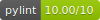

# model-training




<a target="_blank" href="https://cookiecutter-data-science.drivendata.org/">
    
</a>

Training pipeline for restaurant review sentiment analysis ML model

Repository Link: https://github.com/remla2025-team19/model-training

## Requirements

-   make

## Setup

```bash
make create_environment
make requirements
```

## Example Usage

Pass the model version as an argument to the pipeline:

```bash
make pipeline VERSION=1.0.1
```

## Project Organization

```
├── LICENSE            <- Open-source license if one is chosen
├── Makefile           <- Makefile with convenience commands like `make data` or `make train`
├── README.md          <- The top-level README for developers using this project.
├── data
│   ├── processed      <- The final, canonical data sets for modeling.
│   └── raw            <- The original, immutable data dump.
│
├── models             <- Trained and serialized models, model predictions, or model summaries
│
├── pyproject.toml     <- Project configuration file with package metadata for
│                         model_training and configuration for tools like black
│
├── reports            <- Evaluation reports
│
├── requirements.txt   <- The requirements file for reproducing the analysis environment, e.g.
│                         generated with `pip freeze > requirements.txt`
│
└── model_training     <- Source code for use in this project.
    │
    ├── config.py               <- Store useful variables and configuration
    │
    ├── dataset.py              <- Scripts to download or generate data
    │
    ├── modeling
    │   ├── __init__.py
    │   ├── predict.py          <- Code to run model inference with trained models
    │   └── train.py            <- Code to train models
    │
    └── pipeline.py             <- Code to run the full training pipeline
```

## Pipeline Management with DVC

1. Setting up the Google Cloud remote storage.
   First ensure that `dvc[gs]` is installed

```bash
pip install dvc[gs]
```

2. Create remote

```bash
dvc remote add -d sentiment_remote gs://remla2025-team19-bucket
```

3. Add credentials (keep it local since it is a secret)

In order to run these run the pipelines you will need access to `remla_secret.json`. For people not a part of Team-19, please send a request to "sidsharma620@gmail.com".

```bash
dvc remote modify --local sentiment_remote credentialpath "/path/to/remla_secret.json"
```

4. Run your pipeline and push

```bash
dvc repro -f
dvc push
```

5. To run specific stages

```bash
dvc repro prepare
```

6. Conduct custom experiments by altering your parameters in params.yaml

```bash
dvc exp run -S {stage_name}.{parameter}={value}
```

---
